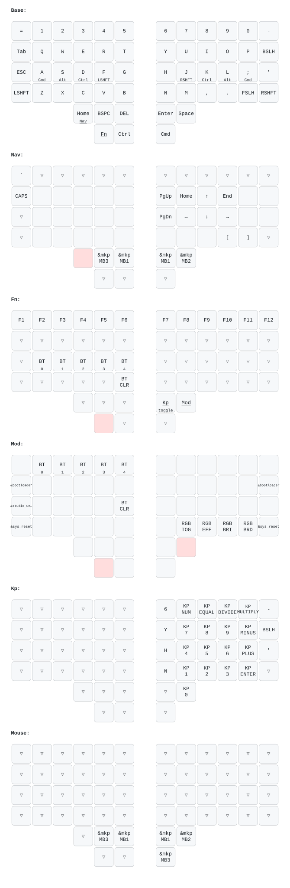

# ZMK Config for Charybdis 4x6 (XI-MK1_2)

무선 스플릿 트랙볼 키보드 **Charybdis 4x6 (XI-MK1_2)** 용 개인 ZMK 설정.

- 하드웨어 정의(핀맵, 왼손 엔코더 2개, WS2812 RGB, PMW3610 트랙볼)는 판매자 저장소
  [Vzhao-L/zmk-for-charybdis](https://github.com/Vzhao-L/zmk-for-charybdis)의 `main-20250226` 브랜치 기준.
- 키맵은 [ezaurum/Adv360-Pro-ZMK](https://github.com/ezaurum/Adv360-Pro-ZMK)(Kinesis Advantage360)
  배열을 Charybdis 56키에 맞게 이식한 것.

## 키맵



Adv360 실사용 키맵(`main` 브랜치 homerow 레이아웃)을 그대로 이식:

- **홈로우 모드**: A=GUI, S=RAlt, **D=Shift, F=Ctrl** / J=RCtrl, K=RShift, L=LAlt, `;`=RGui (190ms 홀드)
- **숫자열 홀드 = F1~F12** (`=`~`-` 키를 꾹 누르면 펑션키)
- **키콤보**: **S+D+F=ESC**, F+S+E=TAB, J+K+L=RShift, J+I+L=RCtrl
- 엄지: 왼손 [Ctrl][BSPC][DEL] + 아래 [Mod][MouseLayer] / 오른손 [ENTER][SPACE] + 아래 [Sticky Shift]

| 레이어 | 진입 | 내용 |
|---|---|---|
| Base | 기본 | 위 홈로우 배열. 하단 양끝 = Nav 홀드 |
| Nav | 하단 양끝 홀드 (`mo NAV`) | **H/J/K/L = vim식 화살표**, `[` `]`(O/P), `` ` ``(G), **트랙볼이 스크롤 모드** |
| Mouse | 왼엄지 아래 안쪽 홀드 (`mo NAV_MOUSE`) | **U=좌클릭, I=우클릭**, Y/O=휠, H/J/K/L=커서 이동 (Adv360과 동일) |
| Mod | 왼엄지 아래 바깥 홀드 | 숫자열 1~5=블루투스 프로파일 0~4, G=페어링 해제, 부트로더, Studio 언락, RGB, 리셋 |

트랙볼: 기본은 커서 이동, Nav 홀드 중에는 스크롤 (`scroll-layers = <1>`).
automouse는 오른손 바닥이 볼에 닿으면 홈로우를 덮어버려서 의도적으로 꺼둠.
왼손 엔코더: 1번 상하 스크롤, 2번 좌우 스크롤.

## 수정 방법

1. **ZMK Studio (실시간, 플래싱 불필요)** — [zmk.studio](https://zmk.studio/)를 크롬 계열
   브라우저에서 열고 USB로 연결하면 즉시 키맵을 바꿀 수 있다 (잠금 해제 불필요, `LOCKING=n`).
2. **소스 수정 후 재빌드** — `config/charybdis.keymap` 수정 후 아래 로컬 빌드.

## 빌드 + 플래싱 (Docker, Actions 불필요)

```sh
./flash.sh          # 빌드 후 오른쪽 플래싱 — 키맵만 바꿨을 땐 이걸로 충분
./flash.sh both     # 빌드 후 오른쪽 → 왼쪽 순서로
./flash.sh -n right # 빌드 생략, 플래싱만
```

안내가 나오면 해당 하프를 USB로 연결하고 리셋 버튼을 **빠르게 두 번** 누르면
자동으로 감지·플래싱·재부팅된다. 마운트에 sudo 대신 docker를 쓴다.

빌드만 하려면 `./build.sh` (첫 실행은 `west update` 때문에 수 분,
워크스페이스는 `~/zmk-workspace`에 캐시됨). 결과물은 `firmware/*.uf2`,
오른쪽에는 ZMK Studio 스니펫이 포함된다.

> 키맵만 바꿀 때는 좌우 모두 플래싱할 필요 없이 **오른쪽(central, 트랙볼 쪽)** 만 플래싱해도 된다.
> 설정(`.conf`)이나 하드웨어 정의를 바꿨다면 양쪽 모두 플래싱.
> ZMK Studio도 central인 오른쪽에 USB로 연결한다.

## 키맵 다이어그램 갱신

[keymap-drawer](https://github.com/caksoylar/keymap-drawer)로 그린다. 로컬에서:

```sh
uvx --python 3.12 --from keymap-drawer keymap -c keymap_drawer.config.yaml \
  parse -z config/charybdis.keymap > img/charybdis.yaml
uvx --python 3.12 --from keymap-drawer keymap -c keymap_drawer.config.yaml \
  draw --dts-layout config/boards/shields/charybdis/charybdis.dtsi img/charybdis.yaml > img/charybdis.svg
```

> `--python 3.12` 는 빼지 말 것. python 3.10 으로 잡히면 옛 keymap-drawer 가 설치돼서
> tree-sitter 문법 버전 충돌(`Incompatible Language version 15`)로 파싱이 실패한다.
> 출력 파일 두 개(`img/charybdis.yaml`, `img/charybdis.svg`)는 CI 워크플로가 만드는 것과 같다.

GitHub Actions를 활성화하면 `.github/workflows/draw-keymaps.yml`이 키맵 커밋 시 자동으로 갱신한다.

## 계보

- [eigatech/zmk-config](https://github.com/eigatech/zmk-config) — 최초 원본 (2022)
- [HeeTuic/zmk-for-charybdis](https://github.com/HeeTuic/zmk-for-charybdis) — ZMK Studio 지원, keymap-drawer, 문서화
- [Vzhao-L/zmk-for-charybdis](https://github.com/Vzhao-L/zmk-for-charybdis) — 실제 판매 하드웨어(XI-MK1_2) 대응: 핀맵, 엔코더, RGB
- 이 저장소 — Vzhao-L 기반 + HeeTuic의 keymap-drawer/배터리 프록시/트랙볼 절전 이식 + Adv360 키맵

베이스 펌웨어: [ZMK v0.3](https://github.com/zmkfirmware/zmk) + [zmk-pmw3610-driver](https://github.com/DoctorWangWang/zmk-pmw3610-driver)
